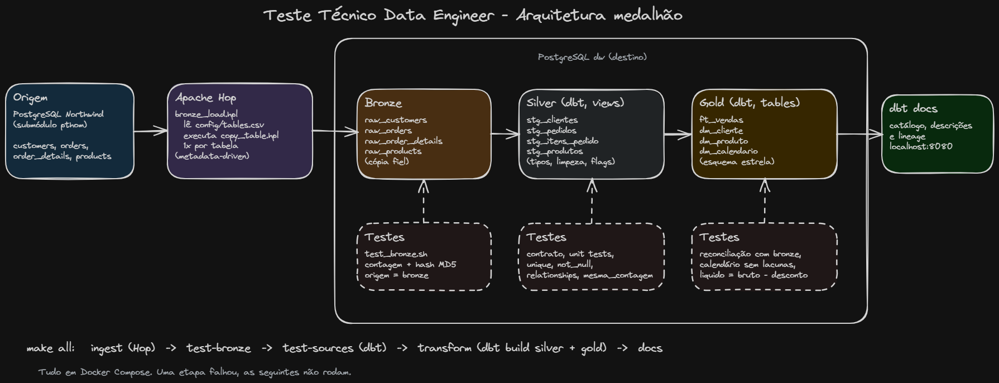

# Teste Técnico Data Engineer - Arruda

Pipeline de dados de ponta a ponta sobre a base de exemplo **Northwind** (PostgreSQL), seguindo a arquitetura medalhão: ingestão na camada **bronze** com Apache Hop e transformação nas camadas **silver** e **gold** com dbt, com testes de qualidade e documentação.

## O desafio

Pegar 4 tabelas da Northwind (`customers`, `orders`, `order_details` e `products`) e levá-las para um banco de destino em três camadas:

- **Bronze:** cópia fiel da origem, sem regra de negócio, com prefixo `raw_`.
- **Silver:** um modelo `stg_` por tabela, com limpeza, tipos corretos, nomes de negócio e tratamento das inconsistências.
- **Gold:** um modelo dimensional para análise de vendas: a fato `ft_vendas` (uma linha por item do pedido) e as dimensões `dm_cliente`, `dm_produto` e `dm_calendario`.

Além disso: testes de qualidade, descrição de todas as tabelas e colunas, e documentação gerada com `dbt docs`.

## Arquitetura



| Camada | Ferramenta | Onde fica | O que tem |
|---|---|---|---|
| Origem | PostgreSQL | banco `northwind` | As 4 tabelas originais |
| Bronze | Apache Hop | banco `dw`, schema `bronze` | `raw_customers`, `raw_orders`, `raw_order_details`, `raw_products` |
| Silver | dbt | banco `dw`, schema `silver` | `stg_clientes`, `stg_pedidos`, `stg_itens_pedido`, `stg_produtos` |
| Gold | dbt | banco `dw`, schema `gold` | `ft_vendas`, `dm_cliente`, `dm_produto`, `dm_calendario` |

Tudo roda em Docker, e um único comando executa as etapas em ordem: ingestão, testes, transformação e documentação.

## Como executar

Pré-requisitos: Docker, `make` e `git`.

```bash
git clone --recursive git@github.com:Gabrielnardino/teste-dataengineer-arruda.git
cd teste-dataengineer-arruda
make all
```

Resultado esperado (cerca de 2 minutos):

```
==> Subindo os bancos de origem e destino
    ok
==> Ingestão da bronze com Apache Hop
    ok em 1.8s
==> Testando a bronze contra a origem
    PASS  customers  (91 ...)
    PASS  orders  (830 ...)
    PASS  order_details  (2155 ...)
    PASS  products  (77 ...)
==> Testes das sources com dbt
    PASS=12 WARN=0 ERROR=0 SKIP=0 TOTAL=12
==> Transformação silver e gold com dbt build
    PASS=102 WARN=1 ERROR=0 SKIP=0 TOTAL=103
    aviso: desconto_fora_da_politica (5 resultados)
==> Documentação com dbt docs generate
    ok
```

O aviso é proposital (ver inconsistências). Se alguma etapa falhar, o processo para e mostra o erro; o log completo de cada etapa fica em `logs/`.

| Comando | O que faz |
|---|---|
| `make all` | Executa tudo |
| `make sql` | Abre o banco de destino no terminal |
| `make docs-serve` | Abre a documentação do dbt em http://localhost:8080 |
| `make clean` | Apaga tudo para começar do zero |

## Como acessar os dados

Pelo terminal, com `make sql`:

```sql
\dt gold.*
select * from gold.ft_vendas limit 10;
```

Ou por um cliente como DBeaver ou pgAdmin (usuário `postgres`, senha `postgres`):

| Banco | Host | Porta | Database |
|---|---|---|---|
| Origem | localhost | 55432 | northwind |
| Destino | localhost | 55433 | dw |

Exemplo, venda líquida por ano:

```sql
select c.ano, round(sum(v.valor_liquido), 2) as venda_liquida
from gold.ft_vendas v
join gold.dm_calendario c on c.data = v.data_pedido
group by c.ano
order by c.ano;
```

## Como foi feito

**Origem.** A Northwind vem do repositório oficial ([pthom/northwind_psql](https://github.com/pthom/northwind_psql)) como submódulo git, sem copiar o arquivo para cá. O compose oficial usa `postgres:latest`, que hoje não sobe com a configuração dele; um arquivo de ajuste (`northwind.override.yml`) fixa a versão 16 sem alterar o original.

**Bronze (Apache Hop).** Um único pipeline genérico copia qualquer tabela, recebendo o nome dela como parâmetro. A lista de tabelas fica em `hop/config/tables.csv`: para ingerir uma tabela nova, basta adicionar uma linha (abordagem *metadata-driven*). A carga é completa (apaga e recarrega), então pode ser executada várias vezes sem duplicar dados. Um teste compara origem e bronze por quantidade de linhas e por um hash do conteúdo.

**Silver (dbt).** Cada tabela ganha nomes em português, tipos corretos e textos limpos (espaços removidos, vazio vira nulo). O tipo de cada coluna é declarado num contrato; se o código devolver algo diferente, o dbt interrompe a execução.

**Gold (dbt).** Esquema estrela com a fato `ft_vendas` e três dimensões. A fato tem uma linha por item do pedido, com quantidade, valor bruto, desconto e valor líquido, calculados com o preço praticado na venda. A `dm_calendario` é gerada pelo próprio dbt, com todos os dias do período dos pedidos.

**Valores exatos.** Os valores são guardados sem arredondamento (até 4 casas decimais), então o total da gold bate exatamente com o da origem: R$ 1.265.793,04. O arredondamento fica para quem consome os dados.

## Inconsistências encontradas

As consultas usadas para encontrá-las estão em `dbt/analyses/profiling.sql`.

| Inconsistência | Tratamento |
|---|---|
| Preço, desconto e frete gravados em `real`, um tipo impreciso (0,15 fica 0,150000006) | Convertidos para `numeric`, que é exato |
| 8 itens com desconto fora do padrão de múltiplos de 5% (1%, 2%, 3%, 4% e 6%) | Mantidos, pois são vendas reais; um teste emite aviso quando aparecem |
| 21 pedidos sem data de envio | São pedidos pendentes (todos do último mês da base); marcados com `pedido_enviado = false` |
| 37 pedidos enviados depois da data limite | Marcados com `entregue_com_atraso = true` |
| 662 itens com preço diferente do preço atual do produto | É o preço da época da venda; a fato usa esse preço |
| Clientes sem região (60) ou sem CEP (1) | Normal na origem (alguns países não usam); na dimensão aparece "Não informado" |
| `discontinued` gravado como 0 e 1 | Convertido para verdadeiro/falso |
| 2 clientes sem nenhum pedido | Mantidos na dimensão de clientes |

## Testes

São 107 testes no dbt, mais a comparação da bronze com a origem. Eles verificam, entre outras coisas:

- que nenhuma linha se perde ou se duplica entre as camadas;
- que as chaves são únicas, não nulas e que toda venda aponta para cliente, produto e data existentes;
- que as contas estão corretas (`valor_liquido = valor_bruto - valor_desconto`);
- que o total de vendas da gold é igual ao da origem;
- que o calendário cobre todo o período, sem dias faltando;
- a lógica de cada transformação com casos específicos (unit tests do dbt).

Para validar os testes, introduzi erros de propósito no código. Todos foram detectados antes de chegar às tabelas.

## Com mais tempo

- Carga incremental, copiando apenas o que mudou na origem.
- Histórico de alterações de clientes e produtos (SCD tipo 2).
- Incluir as demais tabelas da Northwind (categorias, fornecedores, funcionários).
- Executar os testes automaticamente a cada alteração no repositório (CI).
- Agendamento e alertas com um orquestrador como Airflow.
